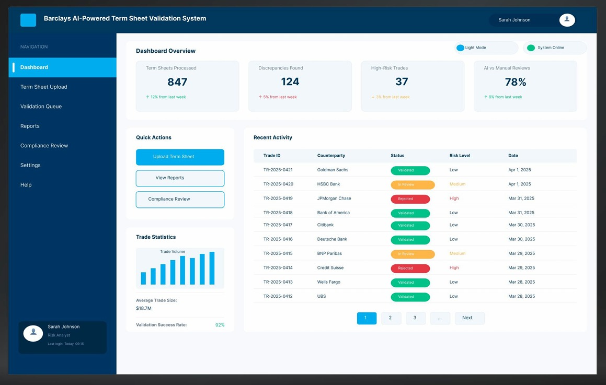
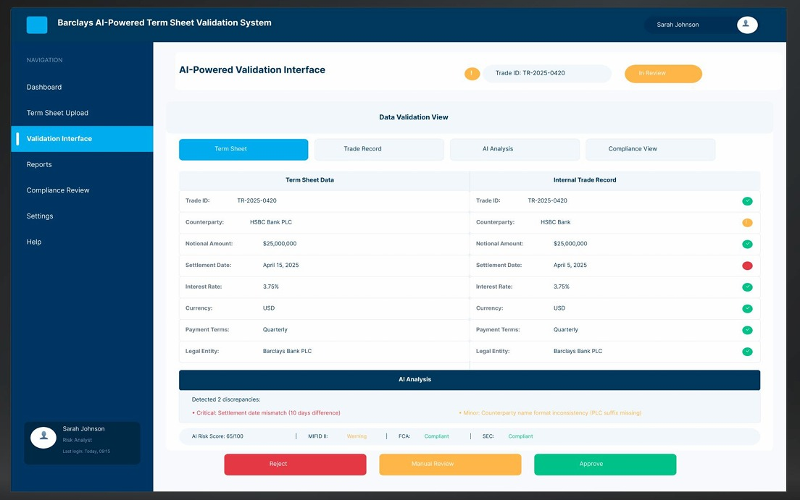
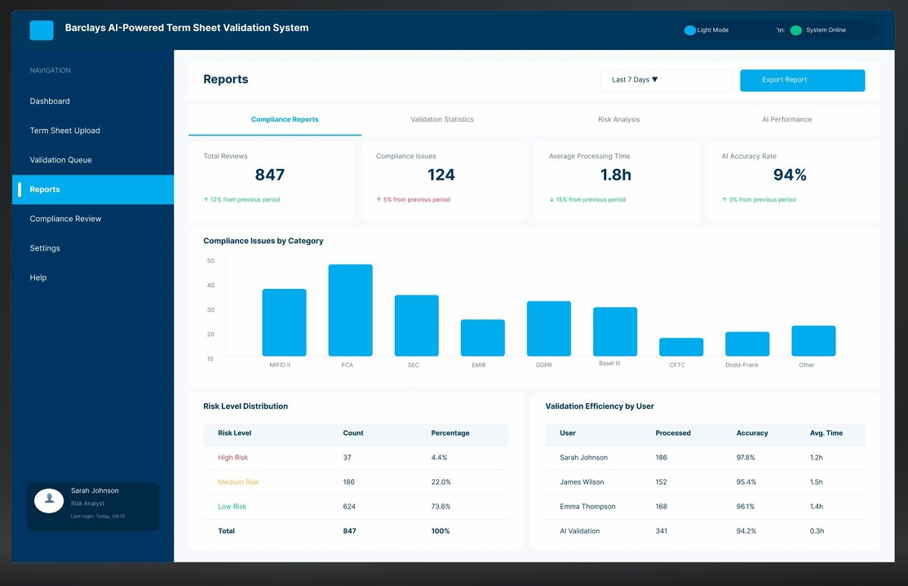
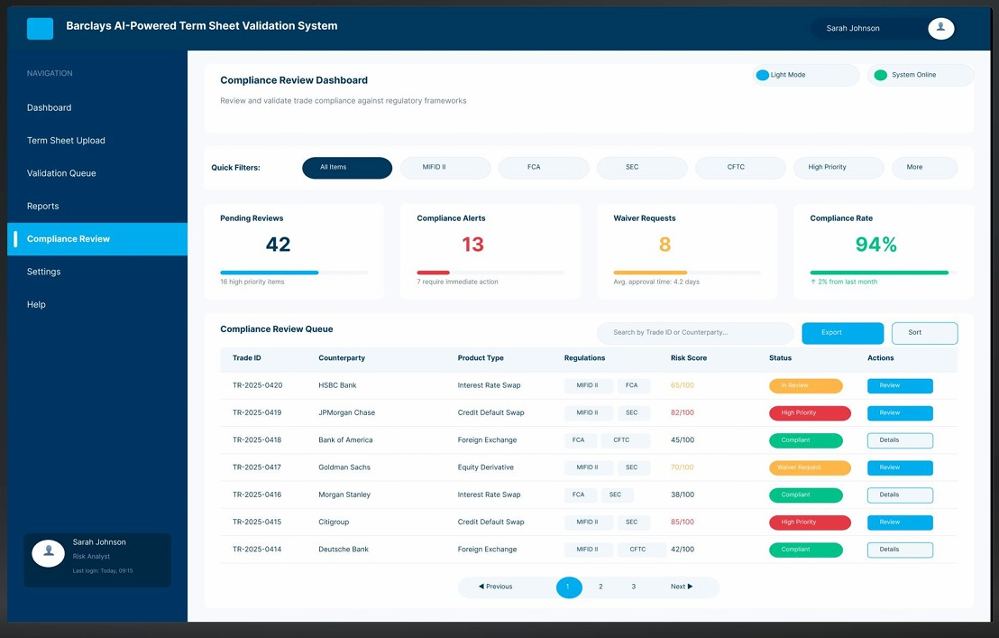

# 📑 Barclays AI-Powered Term Sheet Validation System

An intelligent platform designed to streamline the validation of financial term sheets using cutting-edge AI technologies like OCR, NLP, and Machine Learning.

---

## 🧠 Problem Statement

In post-trade market operations, financial institutions process hundreds of term sheets daily, often manually. This leads to:

- ⏱️ Time-consuming workflows  
- ⚠️ High risk of manual errors  
- 👥 Overuse of human resources on repetitive tasks  
- 🚫 Non-compliance risks with regulatory frameworks  

This system automates the validation process of term sheets, ensuring **speed**, **accuracy**, and **compliance**.

---

## ✨ Key Features

### ✅ AI-Powered Validation Interface
- Compares extracted data from term sheets with internal trade records
- Highlights mismatches and discrepancies with severity levels
- Allows actions: **Reject**, **Manual Review**, **Approve**

### 📊 Dashboard Overview
- Real-time analytics of:
  - Total term sheets processed
  - Discrepancies found
  - High-risk trades
  - AI vs Manual accuracy rates

### 📈 Reports Module
- Compliance breakdown by regulatory categories (e.g., MiFID II, FCA, SEC)
- Validation efficiency by user
- Risk level distribution

### 🔍 Compliance Review System
- Monitors pending reviews and alerts
- Highlights trades with high-risk scores
- Provides compliance queue filtering

---

## 🧰 Technologies Used

- **OCR (Optical Character Recognition)** – Text extraction from scanned PDFs, images  
- **NLP (Natural Language Processing)** – Understanding unstructured text  
- **Machine Learning** – Data matching, risk classification, and anomaly detection  
- **React** – Frontend framework for interactive UI  
- **Node.js / Python** (Suggested) – Backend and AI model integration  
- **Secure APIs** – Data handling and compliance validation  

---

## 📁 Supported Data Formats

- PDF  
- Word Documents (.docx)  
- Excel Sheets (.xlsx, .csv)  
- Emails and Chat exports (txt, eml)  

---

## 🚀 How It Works

1. **Upload Term Sheet** via the dashboard  
2. **AI Engine Extracts and Validates** key fields (Trade ID, Amount, Counterparty, Dates, etc.)  
3. **Discrepancies Identified** and flagged with risk levels  
4. **Manual/Automated Review** is conducted  
5. **Reports Generated** for compliance and performance  

---

## 🔐 Security & Compliance

- Role-based access controls  
- End-to-end encryption for sensitive financial data  
- Audit logs for validation traceability  
- Aligned with regulations: MiFID II, SEC, FCA, CFTC, GDPR  

---

## 📸 UI Screenshots

### 🔹 Dashboard Overview  

### 🔹 AI-Powered Validation Interface  

### 🔹 Reports Section  

### 🔹 Compliance Review Panel  

---

## 👨‍💻 Authors

- **Het Savla**
- **Dhruv Kanadia**

---

## 🏁 Future Scope

- Integration with email/chat clients for auto-ingestion  
- Auto-learning engine for reducing false positives  
- Multi-language term sheet support  
- Smart notification system for compliance alerts  

---

## 📜 License

This project is licensed under the MIT License.

